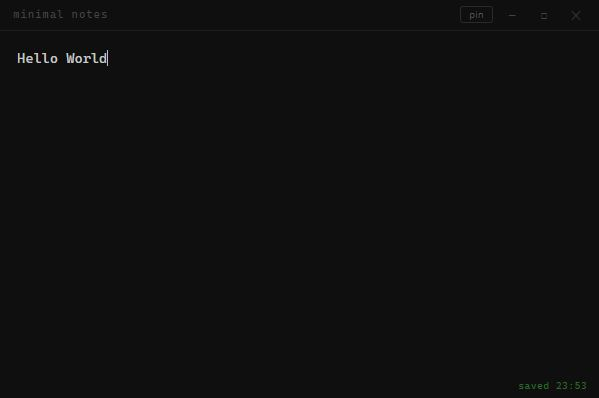

# FlashNote



A minimal always-on-screen note app built with Electron, with Claude Code assistant.

One window, one note. It saves automatically as you type and remembers where you left it.

## Features

- Auto-saves (atomic write — no data loss, flushed on close even mid-debounce)
- Remembers window position and size between sessions (falls back to default if off-screen)
- "Pin" button to toggle always-on-top (persists across restarts)
- Launches at system startup automatically once installed (not in dev mode)
- Note is stored as plain `note.txt` — readable and editable outside the app

## Usage

```bash
npm install
npm start
```

## Build

Make sure you have [Node.js](https://nodejs.org) installed, then:

```bash
npm install
npm run build
```

Output goes to `dist/`.

### Windows

- Produces a `FlashNote Setup x.x.x.exe` installer
- Requires an `icon.ico` file in the project root for the app icon
- If the build fails with a symlink error, enable **Developer Mode**: Settings → System → For developers → Developer Mode

### macOS

- Produces a `.dmg` file
- Requires a `flashnotes.icns` file in the project root for the app icon
- To build a signed app you need an Apple Developer certificate; for personal use you can skip signing

### Linux

- Produces an `.AppImage` file
- Requires `icon.png` (256×256 or larger) in the project root
- Make the AppImage executable after download:
  ```bash
  chmod +x FlashNote*.AppImage
  ./FlashNote*.AppImage
  ```
- For autostart, the app creates `~/.config/autostart/context-note.desktop` automatically on first run

## Add to Startup Manually

### Windows

Run this in a terminal (adjust the path if needed):

```bat
reg add "HKCU\Software\Microsoft\Windows\CurrentVersion\Run" /v "FlashNote" /t REG_SZ /d "\"C:\Users\%USERNAME%\AppData\Local\Programs\FlashNote\FlashNote.exe\"" /f
```

To remove it:

```bat
reg delete "HKCU\Software\Microsoft\Windows\CurrentVersion\Run" /v "FlashNote" /f
```

### macOS

```bash
osascript -e 'tell application "System Events" to make login item at end with properties {path:"/Applications/FlashNote.app", hidden:false}'
```

To remove it:

```bash
osascript -e 'tell application "System Events" to delete login item "FlashNote"'
```

### Linux

Create the autostart entry manually:

```bash
mkdir -p ~/.config/autostart
cat > ~/.config/autostart/flashnote.desktop << EOF
[Desktop Entry]
Type=Application
Name=FlashNote
Exec=/path/to/FlashNote.AppImage
Hidden=false
X-GNOME-Autostart-enabled=true
EOF
```

Replace `/path/to/FlashNote.AppImage` with the actual path to your AppImage. To remove it:

```bash
rm ~/.config/autostart/flashnote.desktop
```

## Files

| File | Purpose |
|---|---|
| `main.js` | Electron main process — window, IPC, config persistence |
| `preload.js` | Secure bridge between main and renderer |
| `index.html` | The UI markup and styles |
| `renderer.js` | UI logic — editor, save debounce, window controls |
| `note.txt` | Your note, plain text |
